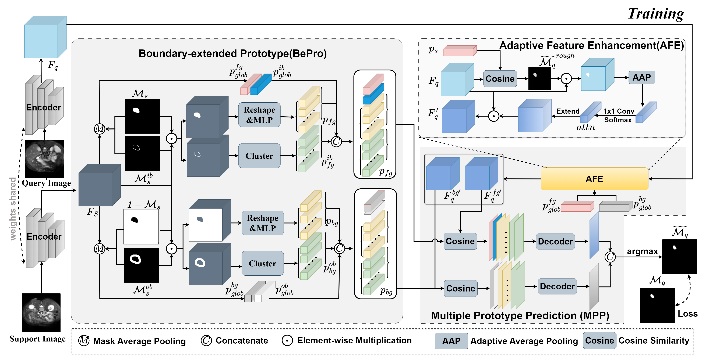
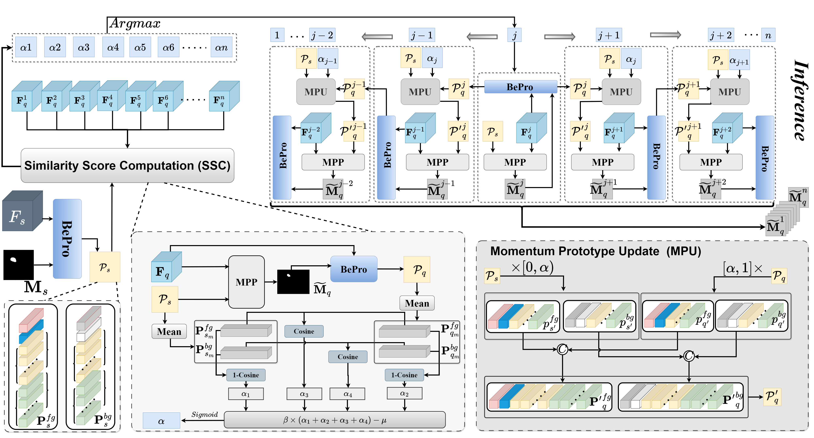

<div align="center">

<h1>Few-Shot Medical Image Segmentation via Boundary-extended Prototype and Momentum Inference </h1>

</div>

# Abstract

Few-Shot Medical Image Segmentation (**FSMIS**) aims to achieve precise segmentation of different organs using minimal annotated data. Current prototype-based FSMIS methods primarily extract prototypes from support samples through random sampling or local averaging. However, due to the extremely small proportion of boundary features, traditional methods have difficulty generating boundary prototypes, resulting in poorly delineated boundaries in segmentation results. Moreover, their reliance on a single support image for segmenting all query images leads to significant performance degradation when substantial discrepancies exist between support and query images. To address these challenges, we propose an innovative solution comprising two key modules:  a Boundary-extended Prototypes (**BePro**) module and a Momentum Inference (**MoIf**) module. BePro constructs boundary prototypes by explicitly clustering the internal and external boundary features to alleviate the problem of boundary ambiguity. MoIf employs the spatial consistency of adjacent slices in 3D medical images to dynamically optimize the prototype representation, thereby reducing the reliance on a single sample. Extensive experiments on three publicly available medical image datasets  demonstrate that our method outperforms the state-of-the-art methods.


# Overview

<h3>Overview of training</h3>
<p align="center">
	
</p>

<h3>Overview of inference</h3>
<p align="center">
	
</p>

# Getting started
## Dependencies
Please install the following essential dependencies:
```
dcm2nii
json5==0.8.5
jupyter==1.0.0
nibabel==2.5.1
numpy==1.24.4
opencv_python==4.11.0.86
Pillow>=8.1.1
sacred==0.8.7
scikit_learn==1.3.2
scikit-image==0.18.3
SimpleITK==2.5.2
torch==2.4.1
torchvision==0.19.1
matplotlib==3.7.5
scipy==1.10.1

```


## Datasets and pre-processing

The pre-processed data and supervoxels can be downloaded by:
1) **Abd-MRI**: [Combined Healthy Abdominal Organ Segmentation data set](https://chaos.grand-challenge.org/)
2) **Abd-CT**: [Multi-Atlas Abdomen Labeling Challenge](https://www.synapse.org/#!Synapse:syn3193805/wiki/218292)
3) **CMR**: [Multi-sequence Cardiac MRI Segmentation data set (bSSFP fold)](https://zmiclab.github.io/projects/mscmrseg19/) 
3) **Prostate-MRI**: [Prostate Magnetic Resonance Images](https://www.cancerimagingarchive.net/collection/prostate-mri/)

Pre-processing is performed according to [Ouyang et al.](https://github.com/cheng-01037/Self-supervised-Fewshot-Medical-Image-Segmentation/tree/2f2a22b74890cb9ad5e56ac234ea02b9f1c7a535) and we follow the procedure on their github repository.
Supervoxel segmentation is performed according to [Hansen et al.](https://github.com/sha168/ADNet.git) and we follow the procedure on their github repository.  

## Training

1. Compile `./data/supervoxels/felzenszwalb_3d_cy.pyx` with cython (`python ./data/supervoxels/setup.py build_ext --inplace`) and run `./data/supervoxels/generate_supervoxels.py` 

2. Download pre-trained ResNet-101 weights [vanilla version](https://download.pytorch.org/models/resnet101-63fe2227.pth) or [deeplabv3 version](https://download.pytorch.org/models/deeplabv3_resnet101_coco-586e9e4e.pth) and put the downloaded pre-trained models into fold `./checkpoint`. The structure of the fold `./checkpoint` is as follows:

   ```
   ./checkpoint
   └── deeplabv3_resnet101_coco-586e9e4e.pth
   └── resnet101-63fe2227.pth
   ```
3. Run `./scripts/abd_mri_train.sh`

## Inference
Run `./scripts/adb_mri_val.sh`

## Visualization
We provide the python file under `visual/` to visualize the segmentation results on the datasets of Abd-MRI, Abd-CT, CMR and Prostate-MRI respectively.
For example, in order to visualize the segmentation results of Abd-MRI dataset. 
We first construct the structure as follows:
```
visual
├── Abd_MRI
│   ├── img
│   │   ├── BePMI
│   │   ├── init
│   └── show_mri_2.py

```
We store the image and the label under `visual/Abd_MRI/img/init`.
Then we puts segmentation results conducted by our trained model into `visual/Abd_MRI/img/BePMI`.
Finally, run `python show_mri_2.py` and the visualized images(.png) are put into `visual/Abd_MRI/sample`.

# Acknowledgement

Our code is based the works: [SSL-ALPNet](https://github.com/cheng-01037/Self-supervised-Fewshot-Medical-Image-Segmentation), [ADNet](https://github.com/sha168/ADNet) and [QNet](https://github.com/ZJLAB-AMMI/Q-Net).


